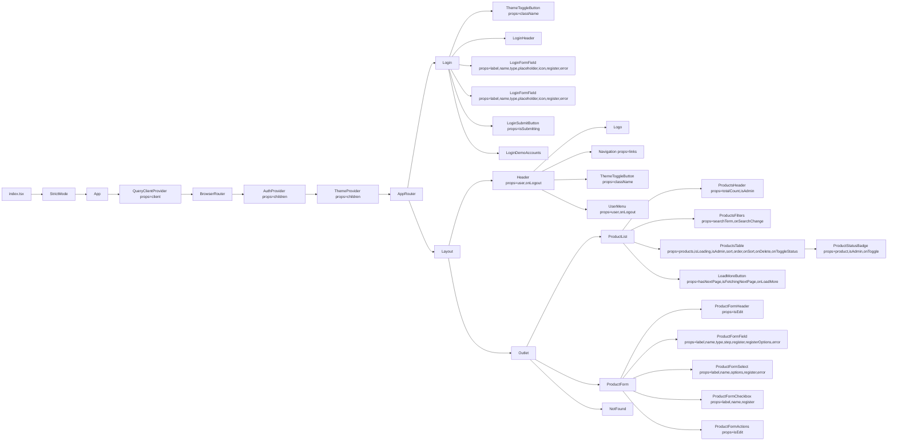

## Діаграма

## Архітектурні рішення

### 1. Шарова архітектура (UI / State / Data)

Проєкт побудований за шаровою архітектурою:

-   **UI (components, pages)** — React-компоненти без прямої роботи з Firebase.
-   **State & orchestration (hooks, context)** — контексти та кастомні хуки, що керують станом і побічними ефектами.
-   **Data (api)** — інкапсуляція доступу до Firestore та бізнес-логіки роботи з даними.

Такий підхід зменшує зв'язність і спрощує масштабування.

---

### 2. Маршрутизація та контроль доступу

Для навігації використано **React Router**:

-   `Login` — публічна зона
-   `PrivateRoute` — захищена зона для авторизованих користувачів
-   `RoleRoute` — рольовий доступ (admin)

Доступ контролюється централізовано, без дублювання логіки в UI.

---

### 3. Глобальні провайдери

Застосунок обгорнуто в глобальні провайдери:

-   `QueryClientProvider` — кешування, мутації, infinite loading
-   `AuthProvider` — авторизація та user state
-   `ThemeProvider` — керування темою (light/dark)
-   `BrowserRouter` — маршрутизація

Це забезпечує доступ до контекстів у всіх компонентах.

---

### 4. Модель аутентифікації (демо)

Аутентифікація реалізована як демо-модель:

-   локальний список `MOCK_USERS`
-   збереження користувача в `localStorage`
-   швидка заміна на реальний auth без змін UI

---

### 5. Завантаження та кешування даних

Для роботи з даними використано **@tanstack/react-query**:

-   `useInfiniteProducts` — нескінченна пагінація
-   CRUD-мутації з інвалідацією кешу
-   оптимістичне оновлення для `updateProduct`

Це забезпечує швидкий і консистентний UI.

---

### 6. Патерн доступу до Firestore

Усі Firestore-операції винесені в `api/products`:

-   фільтрація через `where`
-   пошук, сортування і пагінація на стороні клієнта
-   CRUD через `addDoc`, `updateDoc`, `deleteDoc`

Підхід простий, але для великих даних потребує оптимізації.

---

### 7. Форми та валідація

Форми побудовані з **react-hook-form + zod**:

-   схемна валідація
-   повторно використовувані form-компоненти
-   коректна робота з режимами edit/create

---

### 8. Пошук та стан URL

Стан фільтрів синхронізується з URL:

-   query params як джерело істини
-   debounce для пошуку
-   підтримка оновлення та шерингу URL

---

### 9. Композиція компонентів

UI побудований композиційно:

-   `Layout` — оболонка
-   `Header` — навігація і дії користувача
-   `ProductList` — список + фільтри + таблиця
-   дрібні компоненти винесені для повторного використання

---

### 10. Підхід до стилізації

Використано **Tailwind CSS**:

-   utility-first стиль
-   підтримка темного режиму
-   `cn()` для умовних класів

---

## Вибір компонентної бібліотеки

Проєкт **не використовує повноцінну компонентну бібліотеку** (типу MUI/AntD/Chakra). Натомість обрано підхід:

-   **Tailwind CSS + власні компоненти** (Button, поля форм, таблиця, бейджі, хедер тощо)
-   **lucide-react** як єдина "UI-залежність" для іконок

## Проблеми, з якими зіткнулися, і як вони були вирішені

Нижче перелік типових проблем, які виникали під час розробки цього застосунку, та прийняті рішення для їх усунення.

### 1) Порожні стани та "миготіння" UI під час завантаження даних

**Проблема:** під час першого запиту список товарів коротко показувався порожнім або "стрибав" при зміні фільтрів/сортування.  
**Рішення:** використано `@tanstack/react-query` з `placeholderData`, а для нескінченного списку — стабільний ключ кешу (`["products-infinite", params]`). Це прибрало різкі переходи та зробило UI стабільнішим.

---

### 2) Зайві запити під час пошуку (кожна літера = новий fetch)

**Проблема:** пошуковий інпут тригерив оновлення query params і запит на кожен символ.  
**Рішення:** введено `useDebounce(searchTerm, 300)` і синхронізацію `debouncedSearch` в URL. Запити відбуваються після паузи, UX став прогнозованим.

---

### 3) Поганий UX при зміні статусу bought (затримка, "лаг")

**Проблема:** при кліку на `ProductStatusBadge` зміна статусу відображалась тільки після відповіді з Firestore.  
**Рішення:** реалізовано оптимістичне оновлення у `useUpdateProduct` через `onMutate` (локальне оновлення `products-infinite`), `onError` (відкат), `onSettled` (інвалідація). Тепер UI реагує миттєво.

---

### 4) Різні теми: проблема з "миготінням" теми при перезавантаженні

**Проблема:** при перезавантаженні сторінки тема могла коротко показуватись як світла перед застосуванням темної.  
**Рішення:** `ThemeProvider` визначає тему через `localStorage` або `prefers-color-scheme` і одразу синхронізує `document.documentElement.classList`. Тема стає стабільною.

---
